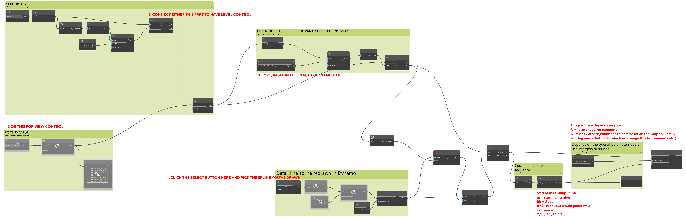

##  Renumbering Carpark Spaces with Spline
> *Please update Revit and Dynamo to the latest version for code compatibility - apparently because of the change in API, they accidentally left out some stuff in the og nodes so setparameter and booleans doesn't really work quite right.*

> *Tested working on Revit 2023.... Dynamo... I'll include 2 versions:
> - Parking Script 2023.dyn
> - Parking Script old.dyn (should work with 2021 Revit)

- Drawing a model spline - KEEP IT SIMPLE and goes through every car park you want to renumber
- Select the spline in Dynamo with the element select node.
- Select the level you want to apply the numbering on.
- Select the type you want to change.
> Either type the type name out with between the "___" or go to the family -> rename -> copy the text and paste it in the code block.
- You can also change the starting sequence as well 
> (This means you can keep counting on other levels otherwise it reset on each level from 1)
- Run!

>img and video demo to come.

Annotations

    
