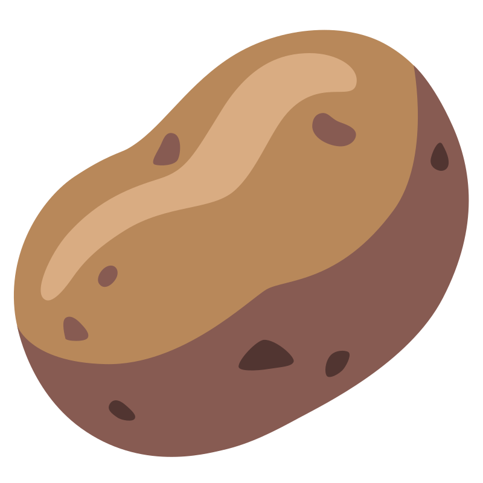

<h1 align="center">
  <a href="https://github.com/potatoman2023/DynamoScripts">
    <!-- Please provide path to your logo here -->
    
  </a>
</h1>

  K2LD Dynamo Scripts Repository
   
  <a href="#about"><strong>It all started by a potato </strong></a>
   
   
  <a href="https://github.com/GITHUB_USERNAME/REPO_SLUG/issues/new?assignees=&labels=bug&template=01_BUG_REPORT.md&title=bug%3A+">Report a Bug</a>
  ·
  <a href="https://github.com/GITHUB_USERNAME/REPO_SLUG/issues/new?assignees=&labels=enhancement&template=02_FEATURE_REQUEST.md&title=feat%3A+">Request a Feature</a>
  .
  <a href="https://github.com/GITHUB_USERNAME/REPO_SLUG/issues/new?assignees=&labels=question&template=04_SUPPORT_QUESTION.md&title=support%3A+">Ask a Question</a>

 

Table of Contents

- [About](#about)
  - [Built With](#built-with)
- [Getting Started](#getting-started)
  - [Prerequisites](#prerequisites)
  - [Installation](#installation)
- [Usage](#usage)
- [Roadmap](#roadmap)
- [Support](#support)
- [Contributing](#contributing)
- [Authors \& contributors](#authors--contributors)
- [Security](#security)
- [License](#license)

---

## About

> This is a respository of all the Dynamo Scripts we have built throughout the establishment of Dynamo...when we have time of course.
>
> This means that some of these might be out of date, and it will be hard to get a hold of the graph developer to update/explaining them. 
>
> We do try hard to group/explain the different parts of the code in the graph so everyone can learn and understand a bit. Maybe as you use it more and more, you'll be able to build a graph one day.

### Built With

> **POTATOMAN:** ABSOLUTE CONFIDENCE IN NOT KNOWING ANYTHING AND EVERYTHING WITH THE HELP OF LOADS OF RESEARCHING AND STICHING STUFF AROUND.

## Getting Started

### Prerequisites

> Common sense and positivity

> You do not need to know coding to use Dynamo Graphs - that being said it would be helpful.

> The graphs are put into their respective folders with a readme for each one of them for a summary and short instruction of use.

> The graphs themselves have .dyn extensions so you only need to download that file (If in panick mode:copy pasta the raw code into a text editor and save it as a .dyn)

> Load the graph read instructions and enjoy.

### Installation

> Please do have Dynamo 2.0 or above installed, some of the graph have dependency on extra packages, we do tend to avoid that but sometimes it can't be helped. Dynamo should prompt you to install the package anyway. 

>Some notatble packages:
> - Spring nodes
> - Clockwork
> - 

## Usage

>**POTATOMAN:** If you don't know how a graph will behave, best test it in an isolated environment. (don't do your tests on your working file duh~)

>

## Roadmap

>**POTATOMAN:** NO ROADMAP AS FOR NOW. I DEVELOPED AS I PLEASED, BITE ME!

## Support

> **POTATOMAN:** Honestly there will be hardly support if I am the sole contributor of this repo, but as the community grows (if it grows) there should be more people to bounce your knowledge around. I do try to group up different functions of the graph with explainations within to guide you through the process in hoping it helps you learn.

## Contributing

First off, thanks for taking the time to contribute! Contributions are what make the our community such an amazing place to learn, inspire, and create. Any contributions you make will benefit everybody else and are **greatly appreciated**.

Please adhere to this project's [Code of conduct](CONTRIBUTING.md)

## Authors & contributors

The original setup of this repository is by [POTATOMAN @ K2LD](https://github.com/potatoman2023).

For a full list of all authors and contributors, see [the contributors page](https://github.com/potatoman2023/DynamoScripts/contributors).

## Security

K2LD Dynamo Scripts Repository follows good practices of security, but 100% security cannot be assured.
K2LD Dynamo Scripts Repository is provided **"as is"** without any **warranty**. Use at your own risk.

## License

This project is licensed under the **MIT license**.

See [LICENSE](LICENSE) for more information.
